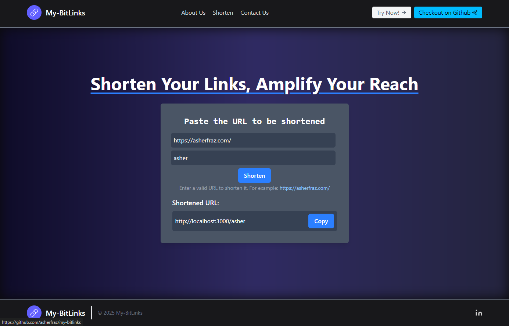

# My-Bitlinks - simple url shortner

A simple and efficient URL shortener built with Next.js.

## Screenshots

## Technologies

- **Frontend**: Next.js, React, Tailwind CSS
- **Backend**: Node.js, Next.js API Routes
- **Database**: MongoDB Localhost

## Installation

1. Clone the repository: `git clone https://github.com/asherfraz/my-bitlinks.git`
2. Install dependencies: `npm install` or `yarn install`
3. setup .env.local file.
4. Start the development server: `npm run dev` or `yarn dev`
5. Open your browser and navigate to `http://localhost:3000`

## Developer

- [Asher Fraz](https://asherfraz.com)
